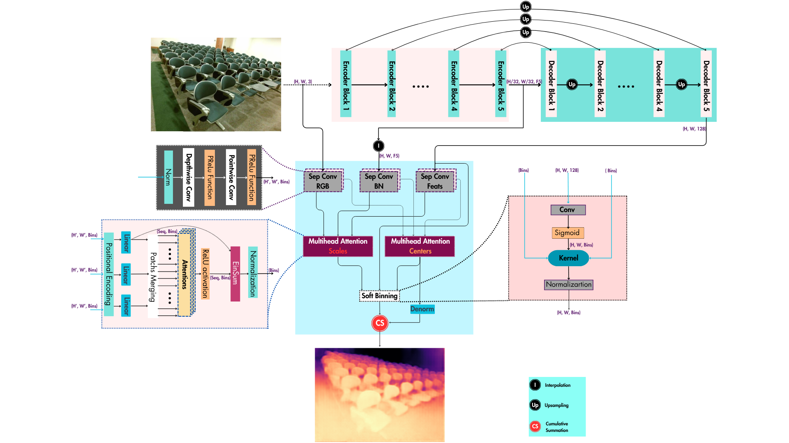

<p align="center">
  <a href="" rel="noopener">
    
  </a>
</p>

<h3 align="center">DepthHist: Depth Estimation Using Differentiable Histogram</h3>

---

<p align="center"> 
    DepthHist is a depth estimation model with a trainable histogram-like layer that dynamically represents depth distributions. 
    It optimizes bin centers and dispersion factors to encode depth as a continuous distribution, with two differentiable 
    histogram-based loss functions to enforce global alignment and structural coherence.
</p>

## 📝 Table of Contents

- [About](#about)
- [Getting Started](#getting_started)
- [Installation](#installation)
- [Data Download](#data-download)
- [Training and Evaluation](#training-evaluation)
- [Model Checkpoints](#model-checkpoints)
- [Author](#author)

## 🧐 About <a name="about"></a>

DepthHist estimates depth by combining a Swin Transformer-based feature extractor with a U-Net-inspired decoder. The key component, HistLayer, integrates RGB input, encoder features, and upsampled decoder outputs to dynamically represent depth distributions. The final depth map is obtained through element-wise multiplication and cumulative summation of HistLayer outputs.

## 🏁 Getting Started <a name="getting_started"></a>

These instructions will help you set up and run the project on your local machine for training and evaluation purposes.

### Prerequisites

Ensure you have Git installed, then clone the repository:

```bash
git clone https://github.com/Chaouki-AI/DepthHist
cd DepthHist/
```

## 📦 Installation <a name="installation"></a>

Ensure you have [Anaconda](https://www.anaconda.com/) installed on your machine. Then, run the following command to set up the environment:

```bash
chmod +x ./setup/installEnv.sh
./setup/installEnv.sh
conda activate DepthHist
```

## 📂 Data Download <a name="data-download"></a>

Follow the instructions in the [LIDAR-DATABOX](https://github.com/Chaouki-AI/LIDAR-DATABOX/) repository to download datasets such as KITTI, NYUv2, and others used for training and evaluation of depth estimation models.

## 🚀 Training and Evaluation <a name="training-evaluation"></a>

### Training

To train the model, update the `args.txt` file (examples can be found in the `args/train` folder). Then, start training with:

```bash
python main.py @args.txt
```


In case of training multiple model variations, you can use [`run.sh`](./run.sh). 

First, define the various configurations using different `args_conf1.txt`  files, add them to the script, and then run:

```bash
chmod +x run.sh
./run.sh 
```
By default, Checkpoints will be saved in the `checkpoints` folder, and TensorBoard logs will be stored in the `runs` folder. You can change it using the `args.txt` file.

### Evaluation

To evaluate the model, create an `args.txt` file as provided in the `args/eval/` folder (e.g., `eval_args_nyu_bins_cauchy.txt`). Then, run:

```bash
python evaluation.py @args/eval/eval_args_nyu_bins_cauchy.txt
```


The evaluation results will be saved as a `.txt` file in the `Eval_result` folder, timestamped for easy identification.

## 📌 Model Checkpoints <a name="model-checkpoints"></a>

Below are the model checkpoints for the KITTI and NYUv2 datasets, along with their evaluation metrics:

| Dataset  | a1    | a2    | a3    | Abs Rel | RMSE  | Log_10 | RMSE Log | SILog  | Sq Rel | Checkpoint |
|----------|-------|-------|-------|---------|-------|--------|----------|--------|--------|------------|
| KITTI   | 0.983 | 0.998 | 0.999 | 0.048  | 1.987 | 0.021  | 0.070   | 6.442 | 0.119 | [Download](https://univsbadz-my.sharepoint.com/personal/chaouki_ziara_univ-sba_dz/_layouts/15/onedrive.aspx?id=%2Fpersonal%2Fchaouki%5Fziara%5Funiv%2Dsba%5Fdz%2FDocuments%2FDepthHist%5FCheckpoints&ga=1) |
| NYUv2   | 0.962 | 0.996 | 0.999 | 0.076  | 0.292 | 0.032  | 0.129   | 8.244 | 0.03 | [Download](https://univsbadz-my.sharepoint.com/personal/chaouki_ziara_univ-sba_dz/_layouts/15/onedrive.aspx?id=%2Fpersonal%2Fchaouki%5Fziara%5Funiv%2Dsba%5Fdz%2FDocuments%2FDepthHist%5FCheckpoints&ga=1) |

## ✍️ Author <a name="author"></a>

[M. Chaouki ZIARA](https://github.com/Chaouki-AI) is affiliated with the RCAM Laboratory, Department of Electronics, Djillali Liabes University, Sidi Bel Abbes, Algeria. (Email: chaouki.ziara@univ-sba.dz, medchaoukiziara@gmail.com) – concept creator, algorithm development, implementation, and manuscript writing.
